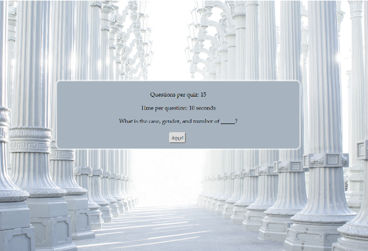

# ancient-greek-declensions-quiz
Made with jQuery, HTML, and CSS, this educational tool reinforces knowledge of all regular Greek nouns with time-based, programmatically generated parsing questions.

# goal
Built to solve two problems: 1) to create randomly generated quiz questions, instead of fixed and predictable ones; and 2) for practice with the setTimeout() and setInterval() methods. Hence the app reinforces knowledge of all regular Greek nouns with time-based, programmatically generated parsing questions. Designed for desktop, but mobile compatible.

# try it yourself!
https://jwkeena.github.io/ancient-greek-declensions-quiz/
